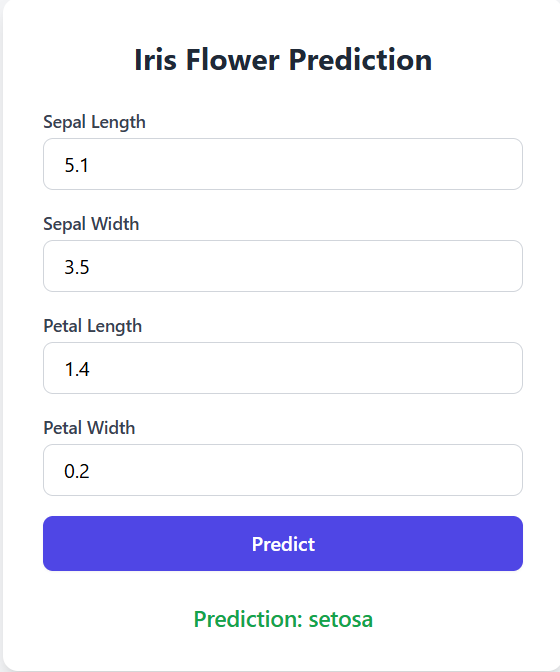

# Iris Flower Classification – Dockerized ML Web App

A machine learning web application that classifies Iris flower species based on 
sepal and petal measurements, built with Flask and a Random Forest classifier, 
deployed using Docker.



## 📌 Overview

This project trains a Random Forest model on the classic Iris dataset and serves 
predictions through a Flask web application. The entire app is containerized with 
Docker for easy, consistent deployment.

## 🚀 Features

- Random Forest classifier trained on the Iris dataset (100 estimators)
- Simple web interface for entering flower measurements
- REST API endpoint (`/predict`) for programmatic predictions
- Pre-trained model (`iris_classifier.pkl`) included for instant use
- Fully containerized with Docker & Docker Compose

## 🗂️ Project Structure

```
├── templates/            # HTML templates for the web UI
├── app.py                # Flask application entry point
├── train_model.py        # Script to train the Random Forest model
├── iris_classifier.pkl   # Pre-trained model file
├── requirements.txt      # Python dependencies
├── Dockerfile            # Docker image configuration
├── docker-compose.yml    # Docker Compose configuration
├── .dockerignore
└── .gitignore
```

## 🛠️ Tech Stack

- Python
- Flask
- scikit-learn (RandomForestClassifier)
- Docker / Docker Compose

## ⚙️ Setup & Installation

### Option 1: Run with Docker (recommended)

```bash
docker-compose up --build
```

Then open `http://localhost:5000` in your browser.

### Option 2: Run locally with Python

```bash
pip install -r requirements.txt
python app.py
```

App will be available at `http://localhost:5000`.

## 🔄 Retraining the Model

To retrain the model on the Iris dataset:

```bash
python train_model.py
```

This regenerates `iris_classifier.pkl`, which stores the trained model along with 
feature names and target class names.

## 📡 API Usage

Send a POST request to `/predict` with the four flower measurements:

```bash
curl -X POST http://localhost:5000/predict \
  -H "Content-Type: application/json" \
  -d '{
    "sepal_length": 5.1,
    "sepal_width": 3.5,
    "petal_length": 1.4,
    "petal_width": 0.2
  }'
```

**Response:**
```json
{
  "prediction": "setosa",
  "class": 0
}
```

## 📊 Dataset

The model is trained on the classic **Iris dataset**, which includes 150 samples 
across 3 species (Setosa, Versicolor, Virginica) with 4 features each: sepal length, 
sepal width, petal length, and petal width.

## 📄 License

This project is open source and available under the MIT License.